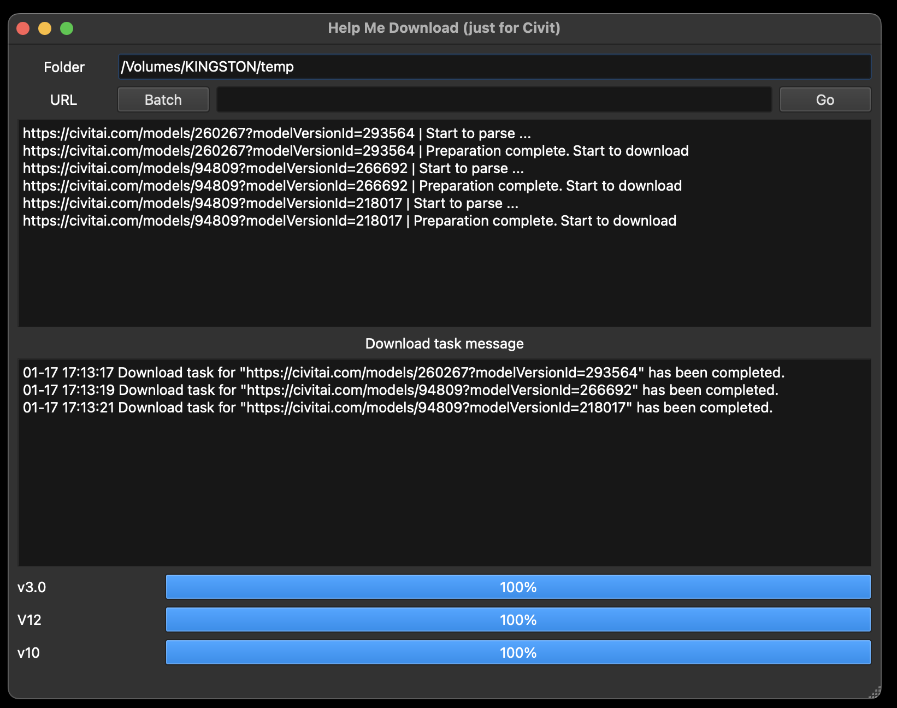
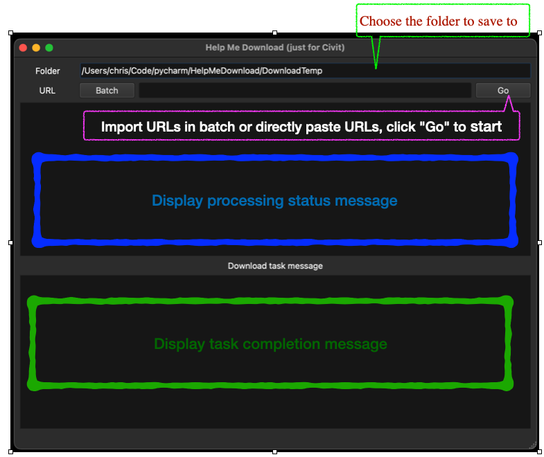

# Help Me Download (v0.1.2)
Used to download sample images provided by various model creators on civitai.com.



## Installation
Use the git clone command to clone the repository.
```
git clone https://github.com/ChrisYangTW/HelpMeDownload.git
```
Switch to the folder where you have placed the repository,
and install the necessary dependencies.
```
pip3 install -r requirements.txt
```
Finally, run the main.py
```
python3 main.py
```

## Usage

1. Click the "Folder" line to select the image storage path.
2. Import URLs in batch or directly paste URLs. (Refer to point 4, 5)
3. Click the "Go" button to start.
4. About import URLs in batch. (Click the "Batch" button)
   * 
   * Paste the URLs line by line.
   * "Load from file" button is also available to import a .txt file (where each URL is listed on a separate line).
   * Clicking "Confirm" will perform an initial validation of the URLs, and if there are no issues, the download task will be initiated.
   * It is recommended not to exceed too many URLs at once to ensure the server responds appropriately.
   * When using batch downloading, the completed URLs will be removed from the list. (That means the URLs that failed to connect will remain in the list for further download attempts.)
5. About URL format.
   * Model URL. (Download images for all versions)
   * 
   * Individual version URL. (Download images for the specific version only)
   * 
6. Option:
   * Show > Show Failed URLs. You can view the failed download links (if any).

## Test environment
```
Python 3.12 (on macOS 14.2.1)
```

## Additional note
The images used for demonstration purposes are sourced from the "majicmix-realistic" model on civitai.com.
If there are any concerns or issues, please leave a comment to let us know. Thank you.

## Others
 Why are there more photos than shown in the example and why are some of them repeated?  
 The downloaded images are obtained from the API and are the images provided by the model's author specifically for that model. The author may have uploaded multiple images, but only a few have been selected for display as examples.