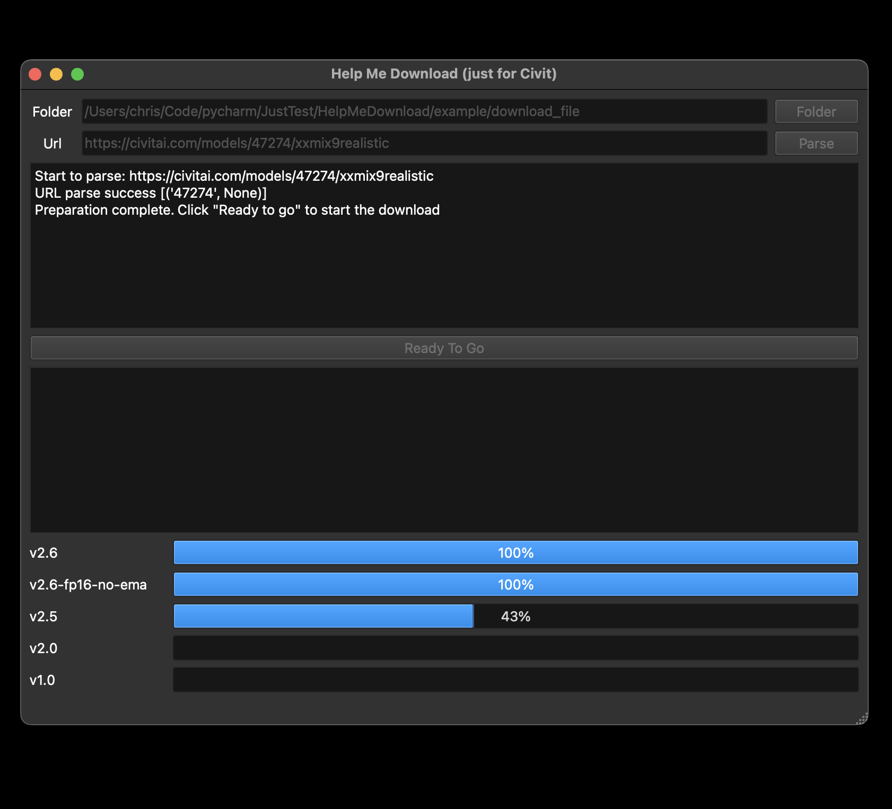
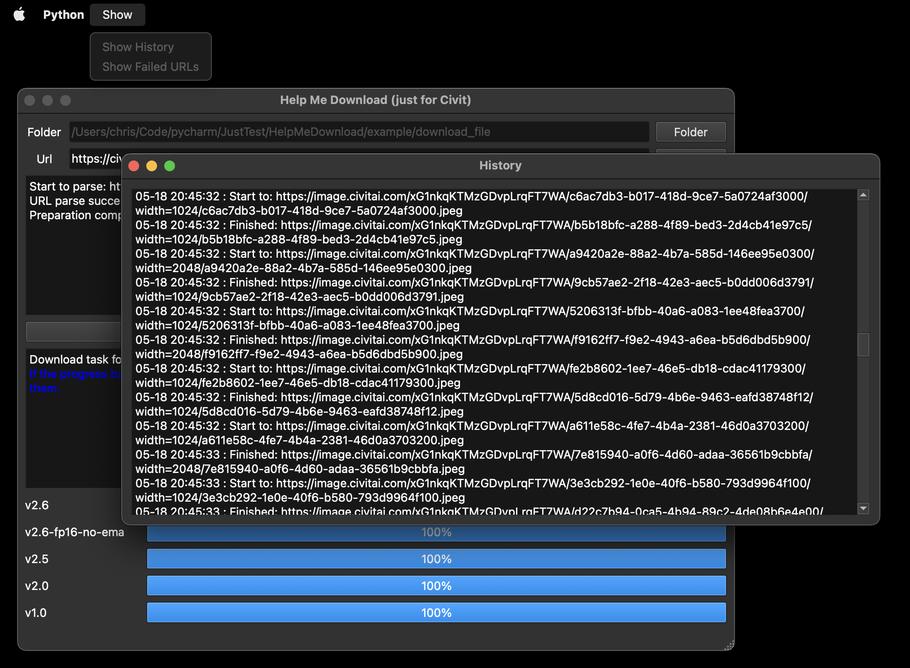
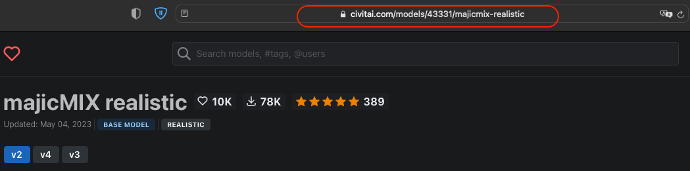
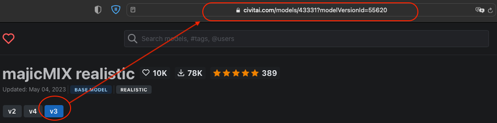

# Help Me Download (v0.1.0)
Used to download sample images provided by various model creators on civitai.com.



## Installation
Use the git clone command to clone the repository.
```
git clone https://github.com/ChrisYangTW/HelpMeDownload.git
```
Switch to the folder where you have placed the repository,
and install the necessary dependencies.
```
pip3 install -r requirements.txt
```
Finally, run the main.py
```
python3 main.py
```

## Executable
You can use pyinstaller, py2app, py2exe to convert the code into an executable file that is compatible with the system.

## Usage

1. Click the "Folder" button to select the image storage path.
2. After pasting the model URL, click the "Parse" button.
   * Model URL. (Download images for all versions)
   * 
   * Individual version URL. (Download images for the specific version only)
   * 
3. When parsing is completed, click the "Ready to go" button to start the download.
4. Option:
   * Show > Show History. You can view the download history.
   * Show > Show Failed URLs. You can view the failed download links (if any).

## Test environment
```
Python 3.11
Macbook Pro16 M1 (OS 13.3.1 (22E261))
```

## Additional note
The current download functionality has been tested successfully, but the UI part may still require some visual improvements.  
The images used for demonstration purposes are sourced from the "majicmix-realistic" model on civitai.com.
If there are any concerns or issues, please leave a comment to let us know. Thank you.